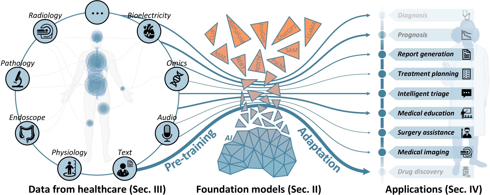

# Awesome-Foundation-Models-for-Advancing-Healthcare

[](https://awesome.re)

[NEWS.20240405] **The related survey [paper](https://arxiv.org/abs/2404.03264) has been released.**

[NOTE] **If you have any questions, please don't hesitate to [contact us](mailto:csyutingh@ust.hk).** 

Foundation model, which is pre-trained on broad data and is able to adapt to a wide range of tasks, is advancing healthcare. It promotes the development of healthcare artificial intelligence (AI) models, breaking the contradiction between limited AI models and diverse healthcare practices. Much more widespread healthcare scenarios will benefit from the development of a healthcare foundation model (HFM), improving their advanced intelligent healthcare services.

This repository is a collection of AWESOME things about Foundation models in healthcare, including language foundation models (LFMs), vision foundation models (VFMs), bioinformatics foundation models (BFMs), and multimodal foundation models (MFMs). Feel free to star and fork.

<p align="center"></p>

This repository provides the improment advicement of current healthcare foundation models based on the following paper:

**[Foundation Model for Advancing Healthcare: Challenges, Opportunities and Future Directions](https://arxiv.org/abs/2404.03264)** [中译版](./files/HFM_Chinese.pdf)<br/> 
[Yuting He](https://yutinghe-list.github.io/), [Fuxiang Huang](https://scholar.google.com/citations?hl=zh-CN&user=4BvQU00AAAAJ), [Xinrui Jiang](https://scholar.google.com/citations?hl=zh-CN&user=OYrbv2oAAAAJ), [Yuxiang Nie](https://jerrrynie.github.io/), [Minghao Wang](https://bmwang.cn/), [Jiguang Wang](https://wang-lab.hkust.edu.hk/people/cv_html/Jiguang_wang_cv.html), [Hao Chen](https://cse.hkust.edu.hk/~jhc/)<br/>
[SMART Lab](https://hkustsmartlab.github.io/), The Hong Kong University of Science and Technology<br/>
<br/>

If you find this repository is useful for you, please cite our paper:
```
@misc{he2024foundation,
      title={Foundation Model for Advancing Healthcare: Challenges, Opportunities, and Future Directions}, 
      author={Yuting He and Fuxiang Huang and Xinrui Jiang and Yuxiang Nie and Minghao Wang and Jiguang Wang and Hao Chen},
      year={2024},
      eprint={2404.03264},
      archivePrefix={arXiv},
      primaryClass={cs.CY}
}
```

# Contents
- [Awesome-Foundation-Models-for-Advancing-Healthcare](#Awesome-Foundation-Models-for-Advancing-Healthcare)
- [Related survery](#related-survey)
- [Methods](#methods)
  - [LFM methods](#lfm-methods)
  - [VFM methods](#vfm-methods)
  - [BFM methods](#bfm-methods)
  - [MFM methods](#mfm-methods)
- [Datasets](#datasets)
  - [LFM datasets](#lfm-datasets)
  - [VFM datasets](#vfm-datasets)
  - [BFM datasets](#bfm-datasets)
  - [MFM datasets](#mfm-datasets)
  - [Large-scale comprehensive databases](#large-scale-comprehensive-databases)
- [Other Resources](#other-resources)
  - [Lectures and tutorials](#lectures-and-tutorials)
  - [Blogs](#blogs)
  - [Related awesome repositories](#related-awesome-repositories)

# Related survey
**2024**
- [arXiv] Foundation models for biomedical image segmentation: A survey. [[Paper]](https://arxiv.org/abs/2401.07654)
- [arXiv] Progress and opportunities of foundation models in bioinformatics. [[Paper]](https://arxiv.org/abs/2402.04286)
- [arXiv] Large language models in bioinformatics: applications and perspectives. [[Paper]](https://arxiv.org/abs/2401.04155)
- [arXiv] Data-centric foundation models in computational healthcare: A survey. [[Paper]](https://arxiv.org/abs/2401.02458)
- [arXiv] Vision-Language Models for Medical Report Generation and Visual Question Answering: A Review. [[Paper]](https://arxiv.org/pdf/2403.02469.pdf)
- 
**2023**
- [ACM Computing Surveys] Pre-trained language models in biomedical domain: A systematic survey. [[Paper]](https://dl.acm.org/doi/full/10.1145/3611651)
- [Nature medicine] Large language models in medicine. [[Paper]](https://www.nature.com/articles/s41591-023-02448-8)
- [arXiv] A survey of large language models in medicine: Progress, application, and challenge. [[Paper]](https://arxiv.org/abs/2311.05112)
- [arXiv] A survey of large language models for healthcare: from data, technology, and applications to accountability and ethics. [[Paper]](https://arxiv.org/abs/2310.05694)
- [arXiv] Large language models illuminate a progressive pathway to artificial healthcare assistant: A review. [[Paper]](https://arxiv.org/abs/2311.01918)
- [arXiv] Foundational models in medical imaging: A comprehensive survey and future vision. [[Paper]](https://arxiv.org/abs/2310.18689)
- [arXiv] CLIP in medical imaging: A comprehensive survey. [[Paper]](https://arxiv.org/abs/2312.07353)
- [arXiv] Medical vision language pretraining: A survey. [[Paper]](https://arxiv.org/abs/2312.06224)
- [MIR] Pre-training in medical data: A survey. [[Paper]](https://link.springer.com/article/10.1007/s11633-022-1382-8)
- [J-BHI] Large AI models in health informatics: Applications, challenges, and the future. [[Paper]](https://ieeexplore.ieee.org/abstract/document/10261199/)
- [MedComm–Future Medicine] Accelerating the integration of ChatGPT and other large-scale AI models into biomedical research and healthcare. [[Paper]](https://onlinelibrary.wiley.com/doi/full/10.1002/mef2.43)
- [Nature] Foundation models for generalist medical artificial intelligence. [[Paper]](https://www.nature.com/articles/s41586-023-05881-4)
- [MedIA] On the challenges and perspectives of foundation models for medical image analysis. [[Paper]](https://www.sciencedirect.com/science/article/pii/S1361841523002566)

# Methods
## LFM methods
**2024**
- [AAAI] Zhongjing: Enhancing the chinese medical capabilities of large language model through expert feedback and realworld multi-turn dialogue. [[Paper]](https://ojs.aaai.org/index.php/AAAI/article/view/29907) [[Code]](https://github.com/SupritYoung/Zhongjing)
- [arXiv] Me LLaMA: Foundation large language models for medical applications [[Paper]](https://arxiv.org/abs/2402.12749) [[Code]](https://github.com/BIDS-Xu-Lab/Me-LLaMA)
- [arXiv] BioMistral: A collection of open-source pretrained large language models for medical domains [[Paper]](https://arxiv.org/abs/2402.10373) [[Code]](https://huggingface.co/BioMistral/BioMistral-7B)
- [arXiv] BiMediX: Bilingual medical mixture of experts LLM [[Paper]](https://arxiv.org/abs/2402.13253) [[Code]](https://github.com/mbzuai-oryx/BiMediX)
- [arXiv] OncoGPT: A medical conversational model tailored with oncology domain expertise on a large language model Meta-AI (LLaMA) [[Paper]](https://arxiv.org/abs/2402.16810) [[Code]](https://github.com/OncoGPT1)
- [arXiv] JMLR: Joint medical LLM and retrieval training for enhancing reasoning and professional question answering capability [[Paper]](https://arxiv.org/abs/2402.17887)

**2023**
- [Bioinformatics] MedCPT: A method for zero-shot biomedical information retrieval using contrastive learning with PubMedBERT. [[Paper]](https://academic.oup.com/bioinformatics/article-abstract/39/11/btad651/7335842) [[Code]](https://github.com/ncbi/MedCPT)
- [arXiv] Pmc-llama: Towards building open-source language models for medicine. [[Paper]](https://arxiv.org/abs/2304.14454) [[Code]](https://github.com/chaoyi-wu/PMC-LLaMA)
- [arXiv] Meditron-70b: Scaling medical pretraining for large language models. [[Paper]](https://arxiv.org/abs/2311.16079) [[Code]](https://github.com/epfLLM/meditron)
- [arXiv] Qilin-med: Multi-stage knowledge injection advanced medical large language model. [[Paper]](https://arxiv.org/abs/2310.09089) [[Code]](https://github.com/epfLLM/meditron)
- [arXiv] Huatuogpt-ii, one-stage training for medical adaption of llms. [[Paper]](https://arxiv.org/abs/2311.09774) [[Code]](https://github.com/freedomintelligence/huatuogpt-ii)
- [NPJ Digit. Med.] A study of generative large language model for medical research and healthcare. [[Paper]](https://www.nature.com/articles/s41746-023-00958-w) [[Code]](https://github.com/uf-hobi-informatics-lab/gatortrongpt)
- [arXiv] From beginner to expert: Modeling medical knowledge into general llms. [[Paper]](https://arxiv.org/abs/2312.01040)
- [arXiv] Huatuo: Tuning llama model with chinese medical knowledge. [[Paper]](https://arxiv.org/abs/2304.06975) [[Code]](https://github.com/SCIR-HI/Huatuo-Llama-Med-Chinese)
- [arXiv] Chatdoctor: A medical chat model fine-tuned on a large language model meta-ai (llama) using medical domain knowledge. [[Paper]](https://arxiv.org/abs/2303.14070) [[Code]](https://github.com/Kent0n-Li/ChatDoctor)
- [arXiv] Medalpaca–an open-source collection of medical conversational ai models and training data. [[Paper]](https://arxiv.org/abs/2304.08247) [[Code]](https://github.com/kbressem/medAlpaca)
- [arXiv] Alpacare: Instruction-tuned large language models for medical application. [[Paper]](https://arxiv.org/abs/2310.14558) [[Code]](https://github.com/xzhang97666/alpacare)
- [arXiv] Huatuogpt, towards taming language model to be a doctor. [[Paper]](https://arxiv.org/abs/2305.15075) [[Code]](https://github.com/FreedomIntelligence/HuatuoGPT)
- [arXiv] Doctorglm: Fine-tuning your chinese doctor is not a herculean task. [[Paper]](https://arxiv.org/abs/2304.01097) [[Code]](https://github.com/xionghonglin/DoctorGLM)
- [arXiv] Bianque: Balancing the questioning and suggestion ability of health llms with multi-turn health conversations polished by chatgpt. [[Paper]](https://arxiv.org/abs/2310.15896) [[Code]](https://github.com/scutcyr/BianQue)
- [arXiv] Taiyi: A bilingual fine-tuned large language model for diverse biomedical tasks. [[Paper]](https://arxiv.org/abs/2311.11608) [[Code]](https://github.com/DUTIR-BioNLP/Taiyi-LLM)
- [Github] Visual med-alpaca: A parameter-efficient biomedical llm with visual capabilities. [[Code]](https://github.com/cambridgeltl/visual-med-alpaca)
- [arXiv] Ophglm: Training an ophthalmology large languageand-vision assistant based on instructions and dialogue. [[Paper]](https://arxiv.org/abs/2306.12174) [[Code]](https://github.com/ML-AILab/OphGLM)
- [arXiv] Chatcad: Interactive computer-aided diagnosis on medical image using large language models. [[Paper]](https://arxiv.org/abs/2302.07257) [[Code]](https://github.com/zhaozh10/ChatCAD)
- [arXiv] Chatcad+: Towards a universal and reliable interactive cad using llms. [[Paper]](https://arxiv.org/abs/2305.15964) [[Code]](https://github.com/zhaozh10/ChatCAD)
- [arXiv] Deid-gpt: Zero-shot medical text de-identification by gpt-4. [[Paper]](https://arxiv.org/abs/2303.11032) [[Code]](https://github.com/yhydhx/ChatGPT-API)
- [arXiv] Can generalist foundation models outcompete special-purpose tuning? case study in medicine. [[Paper]](https://arxiv.org/abs/2311.16452) [[Code]](https://github.com/microsoft/promptbase)
- [arXiv] Medagents: Large language models as collaborators for zero-shot medical reasoning. [[Paper]](https://arxiv.org/abs/2311.10537) [[Code]](https://github.com/gersteinlab/MedAgents)
- [AIME] Soft-prompt tuning to predict lung cancer using primary care free-text dutch medical notes. [[Paper]](https://link.springer.com/chapter/10.1007/978-3-031-34344-5_23) [[Code]](https://bitbucket.org/aumc-kik/prompt_tuning_cancer_prediction/src/master/)
- [arXiv] Clinical decision transformer: Intended treatment recommendation through goal prompting. [[Paper]](https://arxiv.org/abs/2302.00612) [[Code]](https://clinical-decision-transformer.github.io/)
- [Nature] Large language models encode clinical knowledge [[Paper]](https://www.nature.com/articles/s41586-023-06291-2) 
- [arXiv] Towards expert-level medical question answering with large language models [[Paper]](https://arxiv.org/abs/2305.09617) 
- [arXiv] Gpt-doctor: Customizing large language models for medical consultation [[Paper]](https://arxiv.org/abs/2312.10225) 
- [arXiv] Clinicalgpt: Large language models finetuned with diverse medical data and comprehensive evaluation [[Paper]](https://arxiv.org/abs/2306.09968) 
- [arXiv] Leveraging a medical knowledge graph into large language models for diagnosis prediction [[Paper]](https://arxiv.org/abs/2308.14321) 


**2022**
- [NPJ Digit. Med.] A large language model for electronic health records. [[Paper]](https://www.nature.com/articles/s41746-022-00742-2) [[Code]](https://github.com/uf-hobi-informatics-lab/GatorTron)
- [AMIA Annu. Symp. Proc.] Healthprompt: A zero-shot learning paradigm for clinical natural language processing. [[Paper]](https://pubmed.ncbi.nlm.nih.gov/37128372/)
- [BioNLP] Position-based prompting for health outcome generation [[Paper]](https://aclanthology.org/2022.bionlp-1.3/) 


**2021**
- [ACM Trans. Comput. Healthc.] Domain-specific language model pretraining for biomedical natural language processing. [[Paper]](https://dl.acm.org/doi/10.1145/3458754) [[Code]](https://huggingface.co/microsoft/BiomedNLP-BiomedBERT-base-uncased-abstract-fulltext)

**2020**
- [JMIR Med. Info.] Modified bidirectional encoder representations from transformers extractive summarization model for hospital information systems based on character-level tokens (alphabert): development and performance evaluation. [[Paper]](https://medinform.jmir.org/2020/4/e17787/) [[Code]](https://github.com/wicebing/AlphaBERT)
- [Scientific reports] Behrt: transformer for electronic health records. [[Paper]](https://www.nature.com/articles/s41598-020-62922-y) [[Code]](https://github.com/deepmedicine/BEHRT)
- [BioNLP] BioBART: Pretraining and evaluation of a biomedical generative language model. [[Paper]](https://aclanthology.org/2022.bionlp-1.9/) [[Code]](https://github.com/GanjinZero/BioBART)

**2019**
- [NPJ Digit. Med.] ClinicalBERT: A hybrid learning model for natural language inference in healthcare using BERT. [[Paper]](https://www.nature.com/articles/s41746-022-00742-2) [[Code]](https://github.com/EmilyAlsentzer/clinicalBERT)
- [Method. Biochem. Anal.] Biobert: a pre-trained biomedical language representation model for biomedical text mining. [[Paper]](https://academic.oup.com/bioinformatics/article/36/4/1234/5566506) [[Code]](https://github.com/dmis-lab/biobert)

## VFM methods

**2024**

- [arXiv] USFM: A universal ultrasound foundation model generalized to tasks and organs towards label efficient image analysis. [[paper]](https://arxiv.org/html/2401.00153v2) 
- [CVPR] VoCo: A simple-yet-effective volume contrastive learning framework for 3D medical image analysis. [[paper]](https://arxiv.org/html/2402.17300v1)[[Code]](https://github.com/Luffy03/VoCo)
- [NeurIPS] LVM-Med: Learning large-scale self-supervised vision models for medical imaging via second-order graph matching. [[paper]](https://proceedings.neurips.cc/paper_files/paper/2023/file/58cc11cda2a2679e8af5c6317aed0af8-Paper-Conference.pdf) [[Code]](https://github.com/duyhominhnguyen/LVM-Med) 
- [Nature Medicine] Towards a general-purpose foundation model for computational pathology. [[paper]](https://www.nature.com/articles/s41591-024-02857-3) [[Code]](https://github.com/mahmoodlab/UNI)
- [arXiv] RudolfV: A foundation model by pathologists for pathologists. [[paper]](https://arxiv.org/pdf/2401.04079) [[Code]]()
- [Nature Communications] Segment anything in medical images. [[paper]](https://www.nature.com/articles/s41467-024-44824-z) [[Code]](https://github.com/bowang-lab/MedSAM)
- [ICASSP] SAM-OCTA: A fine-tuning strategy for applying foundation model to OCTA image segmentation tasks.[[paper]](https://ieeexplore.ieee.org/iel7/10445798/10445803/10446904.pdf) [[Code]](https://github.com/ShellRedia/SAM-OCTA)
- [WACV] AFTer-SAM: Adapting SAM with axial fusion transformer for medical imaging segmentation. [[paper]](https://openaccess.thecvf.com/content/WACV2024/papers/Yan_AFTer-SAM_Adapting_SAM_With_Axial_Fusion_Transformer_for_Medical_Imaging_WACV_2024_paper.pdf)
- [MIDL] Adaptivesam: Towards efficient tuning of sam for surgical scene segmentation. [[paper]](https://arxiv.org/pdf/2308.03726) [[Code]](https://github.com/JayParanjape/biastuning) 
- [arXiv] SegmentAnyBone: A universal model that segments any bone at any location on MRI [[paper]](https://arxiv.org/html/2401.12974v1) [[Code]](https://github.com/mazurowski-lab/SegmentAnyBone)
- [SSRN] Swinsam: Fine-grained polyp segmentation in colonoscopy images via segment anything model integrated with a Swin transformer decoder. [[paper]](https://papers.ssrn.com/sol3/papers.cfm?abstract_id=4673046)
- [AAAI] Surgicalsam: Efficient class promptable surgical instrument segmentation [[paper]](https://ojs.aaai.org/index.php/AAAI/article/download/28514/29002) [[Code]](https://github.com/wenxi-yue/SurgicalSAM)
- [Medical Image Analysis] Prompt tuning for parameter-efficient medical image segmentation. [[paper]](https://www.sciencedirect.com/science/article/pii/S1361841523002840) [[Code]](https://github.com/marcdcfischer/PUNETR)


**2023**
 - [ICCV] UniverSeg: Universal medical image segmentation. [[paper]](https://openaccess.thecvf.com/content/ICCV2023/papers/Butoi_UniverSeg_Universal_Medical_Image_Segmentation_ICCV_2023_paper.pdf) [[Code]](https://universeg.csail.mit.edu)
- [arXiv] STU-Net: Scalable and transferable medical image segmentation models empowered by large-scale supervised pre-training. [[paper]](https://arxiv.org/pdf/2304.06716.pdf) [[Code]](https://github.com/Ziyan-Huang/STU-Net)
-  [arXiv] SAM-Med3D. [[paper]](https://arxiv.org/pdf/2310.15161.pdf) [[Code]](https://github.com/uni-medical/SAM-Med3D)
-  [Nature] A foundation model for generalizable disease detection from retinal images. [[paper]](https://www.nature.com/articles/s41586-023-06555-x)
-  [arXiv] VisionFM: a multi-modal multi-task vision foundation model for generalist ophthalmic Artificial Intelligence. [[paper]](https://arxiv.org/pdf/2310.04992.pdf)
- [arXiv] Segvol: Universal and interactive volumetric medical image segmentation. [[paper]](https://arxiv.org/pdf/2311.13385.pdf) [[Code]](https://github.com/BAAI-DCAI/SegVol)
- [MICCAI] Models Genesis: Generic autodidactic models for 3D medical image analysis. [[paper]](https://www.ncbi.nlm.nih.gov/pmc/articles/PMC7405596/) [[Code]](https://github.com/MrGiovanni/ModelsGenesis)
- [MICCAI] Deblurring masked autoencoder is better recipe for ultrasound image recognition. [[paper]](https://link.springer.com/chapter/10.1007/978-3-031-43907-0_34) [[Code]](https://github.com/MembrAI/DeblurringMIM)
- [arXiv] Mis-fm: 3d medical image segmentation using foundation models pretrained on a large-scale unannotated dataset. [[paper]](https://arxiv.org/pdf/2304.06716.pdf) [[Code]](https://github.com/openmedlab/MIS-FM)
- [MICCAI] Foundation model for endoscopy video analysis via large-scale self-supervised pre-train. [[paper]](https://link.springer.com/chapter/10.1007/978-3-031-43996-4_10)[[Code]](https://github.com/med-air/Endo-FM) 
- [MIDL] MoCo pretraining improves representation and transferability of chest X-ray models. [[paper]](https://proceedings.mlr.press/v143/sowrirajan21a.html) [[Code]]()
- [arXiv] BROW: Better features for whole slide image based on self-distillation[[paper]](https://arxiv.org/pdf/2309.08259.pdf) 
- [arXiv] Computational pathology at health system scale--self-supervised foundation models from three billion images. [[paper]](https://arxiv.org/pdf/2310.07033.pdf)
- [CVPR] Geometric visual similarity learning in 3D medical image self-supervised pre-training.[[paper]](http://openaccess.thecvf.com/content/CVPR2023/papers/He_Geometric_Visual_Similarity_Learning_in_3D_Medical_Image_Self-Supervised_Pre-Training_CVPR_2023_paper.pdf) [[Code]](https://github.com/YutingHe-list/GVSL)
- [arXiv] Virchow: A million-slide digital pathology foundation model.[[paper]](https://arxiv.org/html/2309.07778v5) [[Code]]()
- [arXiv] Ma-sam: Modality-agnostic sam adaptation for 3d medical image segmentation.[[paper]](https://arxiv.org/pdf/2309.08842) [[Code]](https://github.com/cchen-cc/MA-SAM)
- [ICCV] Comprehensive multimodal segmentation in medical imaging: combining YOLOv8 with SAM and HQ-SAM models. [[paper]](https://openaccess.thecvf.com/content/ICCV2023W/CVAMD/papers/Pandey_Comprehensive_Multimodal_Segmentation_in_Medical_Imaging_Combining_YOLOv8_with_SAM_ICCVW_2023_paper.pdf) 
- [arXiv] 3DSAM-adapter: Holistic adaptation of SAM from 2D to 3D for promptable medical image segmentation.[[paper]](https://arxiv.org/pdf/2306.13465) [[Code]](https://github.com/med-air/3DSAM-adapter)
- [arXiv] Part to whole: Collaborative prompting for surgical instrument segmentation. [[paper]](https://arxiv.org/html/2312.14481v1) [[Code]](https://github.com/wenxi-yue/SurgicalPart-SAM)
- [arXiv] Towards general purpose vision foundation models for medical image analysis: An experimental study of DINOv2 on radiology benchmarks.[[paper]](https://arxiv.org/html/2312.02366v3) [[Code]](https://github.com/MohammedSB/DINOv2ForRadiology)
- [arXiv] Skinsam: Empowering skin cancer segmentation with segment anything model.[[paper]](https://arxiv.org/pdf/2304.13973) 
- [arXiv] Polyp-sam: Transfer sam for polyp segmentation. [[paper]](https://arxiv.org/pdf/2305.00293) [[Code]](https://github.com/ricklisz/Polyp-SAM)
- [arXiv] Customized segment anything model for medical image segmentation. [[paper]](https://arxiv.org/pdf/2304.13785) [[Code]](https://github.com/hitachinsk/SAMed)
- [arXiv] Ladder fine-tuning approach for SAM integrating complementary network. [[paper]](https://arxiv.org/pdf/2306.12737) [[Code]](https://github.com/11yxk/SAM-LST)
- [arXiv] Cheap lunch for medical image segmentation by fine-tuning sam on few exemplars. [[paper]](https://arxiv.org/pdf/2308.14133)
- [arXiv] SemiSAM: Exploring SAM for enhancing semi-supervised medical image segmentation with extremely limited annotations. [[paper]](https://arxiv.org/pdf/2312.06316)
- [IWMLMI] Mammo-sam: Adapting foundation segment anything model for automatic breast mass segmentation in whole mammograms. [[paper]](https://link.springer.com/chapter/10.1007/978-3-031-45673-2_18)
- [arXiv] Promise: Prompt-driven 3D medical image segmentation using pretrained image foundation models. [[paper]](https://arxiv.org/pdf/2310.19721) [[Code]](https://github.com/MedICL-VU/ProMISe)
- [arXiv] Medical sam adapter: Adapting segment anything model for medical image segmentation. [[paper]](https://arxiv.org/html/2304.12620v7) [[Code]](https://github.com/KidsWithTokens/Medical-SAM-Adapter)
- [arXiv] SAM-Med2D [[paper]](https://arxiv.org/pdf/2308.16184.pdf) [[Code]](https://github.com/uni-medical/SAM-Med2D)
- [arXiv] Medivista-sam: Zero-shot medical video analysis with spatio-temporal sam adaptation. [[paper]](https://arxiv.org/pdf/2309.13539) [[Code]](https://github.com/kimsekeun/MediViSTA-SAM)
- [arXiv] Samus: Adapting segment anything model for clinically-friendly and generalizable ultrasound image segmentation. [[paper]](https://arxiv.org/pdf/2309.06824)
- [MICCAI] Input augmentation with sam: Boosting medical image segmentation with segmentation foundation model.  [[paper]](https://link.springer.com/chapter/10.1007/978-3-031-47401-9_13) [[Code]](https://github.com/yizhezhang2000/SAMAug)
- [arXiv] AutoSAM: Adapting SAM to medical images by overloading the prompt encoder. [[paper]](https://arxiv.org/pdf/2306.06370)
- [arXiv] DeSAM: Decoupling segment anything model for generalizable medical image segmentation [[paper]](https://arxiv.org/pdf/2306.00499) [[Code]](https://github.com/yifangao112/DeSAM)
- [bioRxiv] A foundation model for cell segmentation.[[paper]](https://www.ncbi.nlm.nih.gov/pmc/articles/PMC10690226/) [[Code]](https://label-dev.deepcell.org/)
- [MICCAI] SAM-U: Multi-box prompts triggered uncertainty estimation for reliable SAM in medical image. [[paper]](https://link.springer.com/chapter/10.1007/978-3-031-47425-5_33)
- [MICCAI] Sam-path: A segment anything model for semantic segmentation in digital pathology. [[paper]](https://link.springer.com/chapter/10.1007/978-3-031-47401-9_16) 
- [arXiv] All-in-sam: from weak annotation to pixel-wise nuclei segmentation with prompt-based finetuning.[[paper]](https://arxiv.org/pdf/2307.00290) 
- [arXiv] Polyp-sam++: Can a text guided sam perform better for polyp segmentation? [[paper]](https://arxiv.org/pdf/2308.06623) [[Code]](https://github.com/RisabBiswas/Polyp-SAM++)
- [arXiv] Segment anything model with uncertainty rectification for auto-prompting medical image segmentation. [[paper]](https://arxiv.org/pdf/2311.10529) 
- [arXiv] MedLSAM: Localize and segment anything model for 3D medical images. [[paper]](https://arxiv.org/pdf/2306.14752) [[Code]](https://github.com/openmedlab/MedLSAM)
- [arXiv] nnSAM: Plug-and-play segment anything model improves nnUNet performance. [[paper]](https://arxiv.org/pdf/2309.16967) [[Code]](https://github.com/Kent0n-Li/Medical-Image-Segmentation)
- [arXiv] EviPrompt: A training-free evidential prompt generation method for segment anything model in medical images. [[paper]](https://arxiv.org/pdf/2311.06400) 
- [arXiv] One-shot localization and segmentation of medical images with foundation models. [[paper]](https://arxiv.org/pdf/2310.18642) 
- [arXiv] Samm (segment any medical model): A 3d slicer integration to sam. [[paper]](https://arxiv.org/html/2304.05622v4) [[Code]](https://github.com/bingogome/samm)
- [arXiv] Task-driven prompt evolution for foundation models.[[paper]](https://dl.acm.org/doi/abs/10.1007/978-3-031-47401-9_25) 

**2022**
- [Machine Learning with Applications] Self supervised contrastive learning for digital histopathology. [[paper]](https://www.sciencedirect.com/science/article/pii/S2666827021000992) [[Code]](https://github.com/ozanciga/self-supervised-histopathology)
- [Medical Image Analysis] Transformer-based unsupervised contrastive learning for histopathological image classification. [[paper]](https://www.sciencedirect.com/science/article/pii/S1361841522002043) [[Code]](https://github.com/Xiyue-Wang/TransPath)
- [arXiv] Self-supervised learning from 100 million medical images. [[paper]](https://arxiv.org/pdf/2201.01283.pdf) 
- [CVPR] Self-supervised pre-training of swin transformers for 3d medical image analysis.[[paper]](https://openaccess.thecvf.com/content/CVPR2022/papers/Tang_Self-Supervised_Pre-Training_of_Swin_Transformers_for_3D_Medical_Image_Analysis_CVPR_2022_paper.pdf) [[Code]](https://monai.io/research/swin-unetr)

**2021**
- [Medical Image Analysis] Models genesis. [[paper]](https://www.sciencedirect.com/science/article/pii/S1361841520302048) [[Code]](https://github.com/MrGiovanni/ModelsGenesis)
- [Medical Imaging with Deep Learning] MoCo pretraining improves representation and transferability of chest X-ray models. [[paper]](https://proceedings.mlr.press/v143/sowrirajan21a.html)
- [IEEE transactions on medical imaging] Transferable visual words: Exploiting the semantics of anatomical patterns for self-supervised learning.[[Paper]](https://ieeexplore.ieee.org/iel7/42/4359023/09359803.pdf)

**2020**
- [MICCAI] Comparing to learn: Surpassing imageNet pretraining on radiographs by comparing image representations. [[paper]](https://link.springer.com/chapter/10.1007/978-3-030-59710-8_39) [[Code]](https://github.com/funnyzhou/C2L_MICCAI2020)

**2019**
- [arXiv] Med3D: Transfer learning for 3D medical image analysis. [[paper]](https://arxiv.org/pdf/1904.00625.pdf) [[Code]](https://github.com/Tencent/MedicalNet)  


## BFM methods
**2024**
  - [Nucleic Acids Research] Multiple sequence alignment-based RNA language model and its application to structural inference. [[Paper]](https://academic.oup.com/nar/article/52/1/e3/7369930), [[Code]](https://github.com/yikunpku/RNA-MSM)
  - [Nature Methods] scGPT: toward building a foundation model for single-cell multi-omics using generative AI. [[Paper]](https://www.nature.com/articles/s41592-024-02201-0), [[Code]](https://github.com/bowang-lab/scGPT)
  - [Nature Machine Intelligence] A 5’ UTR language model for decoding untranslated regions of mRNA and function predictions. [[Paper]](https://www.nature.com/articles/s42256-024-00823-9), [[Code]](https://github.com/a96123155/UTR-LM)
 - [ICLR 2024] CellPLM: Pre-training of Cell Language Model Beyond Single Cells. [[Paper]](https://www.biorxiv.org/content/10.1101/2023.10.03.560734v1), [[Code]](https://github.com/OmicsML/CellPLM)
**2023**
  - [arXiv] DNAGPT: A generalized pre-trained tool for versatile DNA sequence analysis tasks. [[Paper]](https://arxiv.org/abs/2307.05628), [[Code]](https://github.com/TencentAILabHealthcare/DNAGPT)
  - [arXiv] HyenaDNA: Long-range genomic sequence modeling at single nucleotide resolution. [[Paper]](https://arxiv.org/abs/2306.15794), [[Code]](https://github.com/HazyResearch/hyena-dna)
  - [Nature Biotechnology] Large language models generate functional protein sequences across diverse families. [[Paper]](https://www.nature.com/articles/s41587-022-01618-2), [[Code]](https://github.com/salesforce/progen)
  - [Cell Systems] ProGen2: Exploring the boundaries of protein language models. [[Paper]](https://www.cell.com/cell-systems/abstract/S2405-4712(23)00272-7), [[Code]](https://github.com/salesforce/progen/tree/main/progen2)
  - [Nature] Transfer learning enables predictions in network biology. [[Paper]](https://www.nature.com/articles/s41586-023-06139-9), [[Code]](https://huggingface.co/ctheodoris/Geneformer)
  - [arXiv] DNABERT-2: Efficient foundation model and benchmark for multi-species genome. [[Paper]](https://arxiv.org/abs/2306.15006), [[Code]](https://github.com/Zhihan1996/DNABERT_2)
  - [bioRxiv] The nucleotide transformer: Building and evaluating robust foundation models for human genomics. [[Paper]](https://www.biorxiv.org/content/10.1101/2023.01.11.523679v1), [[Code]](https://github.com/instadeepai/nucleotide-transformer)
  - [bioRxiv] GENA-LM: A family of open-source foundational models for long DNA sequences. [[Paper]](https://www.biorxiv.org/content/10.1101/2023.06.12.544594v2), [[Code]](https://github.com/AIRI-Institute/GENA_LM)
  - [bioRxiv] Self-supervised learning on millions of pre-mRNA sequences improves sequence-based RNA splicing prediction. [[Paper]](https://www.biorxiv.org/content/10.1101/2023.01.31.526427v2), [[Code]](https://github.com/biomed-AI/SpliceBERT)
  - [bioRxiv] Deciphering 3’ UTR mediated gene regulation using interpretable deep representation learning. [[Paper]](https://www.biorxiv.org/content/10.1101/2023.09.08.556883v1), [[Code]](https://github.com/yangyn533/3UTRBERT)
  - [Science] Evolutionary-scale prediction of atomic-level protein structure with a language model. [[Paper]](https://www.science.org/doi/10.1126/science.ade2574), [[Code]](https://github.com/facebookresearch/esm)
  - [bioRxiv] Universal cell embeddings: A foundation model for cell biology. [[Paper]](https://www.biorxiv.org/content/10.1101/2023.11.28.568918v1), [[Code]](https://github.com/snap-stanford/UCE)
  - [bioRxiv] Large scale foundation model on single-cell transcriptomics. [[Paper]](https://www.biorxiv.org/content/10.1101/2023.05.29.542705v4), [[Code]](https://github.com/biomap-research/scFoundation)
  - [arXiv] Large-scale cell representation learning via divide-and-conquer contrastive learning. [[Paper]](https://arxiv.org/abs/2306.04371), [[Code]](https://github.com/PharMolix/OpenBioMed)
  - [bioRxiv] CodonBERT: Large language models for mRNA design and optimization. [[Paper]](https://www.biorxiv.org/content/10.1101/2023.09.09.556981v2), [[Code]](https://github.com/Sanofi-Public/CodonBERT)
  - [bioRxiv] xTrimoPGLM: Unified 100B-scale pre-trained transformer for deciphering the language of protein. [[Paper]](https://www.biorxiv.org/content/10.1101/2023.07.05.547496v4)
  - [bioRxiv] GenePT: A simple but effective foundation model for genes and cells built from ChatGPT. [[Paper]](https://www.biorxiv.org/content/10.1101/2023.10.16.562533v2), [[Code]](https://github.com/yiqunchen/GenePT)
  - [bioRxiv] scELMo: Embeddings from language models are good learners for single-cell data analysis. [[Paper]](https://www.biorxiv.org/content/10.1101/2023.12.07.569910v2), [[Code]](https://github.com/HelloWorldLTY/scELMo)
  - [bioRxiv] Evaluating the Utilities of Foundation Models in Single-cell Data Analysis. [[Paper]](https://www.biorxiv.org/content/10.1101/2023.09.08.555192v5), [[Code]](https://github.com/HelloWorldLTY/scEval)
  - [bioRxiv] GeneCompass: Deciphering Universal Gene Regulatory Mechanisms with Knowledge-Informed Cross-Species Foundation Model. [[Paper]](https://www.biorxiv.org/content/10.1101/2023.09.26.559542v1), [[Code]](https://github.com/xCompass-AI/GeneCompass)
 
**2022**
  - [Nature Machine Intelligence] scBERT as a large-scale pretrained deep language model for cell type annotation of single-cell RNA-seq data. [[Paper]](https://www.nature.com/articles/s42256-022-00534-z), [[Code]](https://github.com/TencentAILabHealthcare/scBERT)
  - [bioRxiv] Interpretable RNA foundation model from unannotated data for highly accurate RNA structure and function predictions. [[Paper]](https://www.biorxiv.org/content/10.1101/2022.08.06.503062v2), [[Code]](https://github.com/ml4bio/RNA-FM)
  - [NAR Genomics & Bioinformatics] Informative RNA base embedding for RNA structural alignment and clustering by deep representation learning. [[Paper]](https://academic.oup.com/nargab/article/4/1/lqac012/6534363), [[Code]](https://github.com/mana438/RNABERT)
  - [Nature Biotechnology] Single-sequence protein structure prediction using language models and deep learning. [[Paper]](https://www.nature.com/articles/s41587-022-01432-w), [[Code]](https://github.com/aqlaboratory/rgn2)

**2021**
  - [Bioinformatics] DNABERT: pre-trained Bidirectional Encoder Representations from Transformers model for DNA-language in genome. [[Paper]](https://academic.oup.com/bioinformatics/article/37/15/2112/6128680), [[Code]](https://github.com/jerryji1993/DNABERT)
  - [IEEE TPAMI] ProtTrans: Toward understanding the language of life through self-supervised learning. [[Paper]](https://ieeexplore.ieee.org/document/9477085), [[Code]](https://github.com/agemagician/ProtTrans)
  - [ICML 2021] MSA Transformer. [[Paper]](https://proceedings.mlr.press/v139/rao21a.html), [[Code]](https://github.com/rmrao/msa-transformer)
  - [PNAS] Biological structure and function emerge from scaling unsupervised learning to 250 million protein sequences. [[Paper]](https://www.pnas.org/doi/10.1073/pnas.2016239118), [[Code]](https://github.com/facebookresearch/esm)
  - [Nature] Highly accurate protein structure prediction with AlphaFold. [[Paper]](https://www.nature.com/articles/s41586-021-03819-2), [[Code]](https://github.com/google-deepmind/alphafold)
  - [arXiv] Multi-modal self-supervised pre-training for regulatory genome across cell types. [[Paper]](https://arxiv.org/abs/2110.05231), [[Code]](https://github.com/ZovcIfzm/GeneBERT)

## MFM methods
**2024**
- [ICASSP] Etp: Learning transferable ecg representations via ecg-text pretraining. [[Paper]](https://ieeexplore.ieee.org/document/10446742)
- [NeurIPS] Med-unic: Unifying cross-lingual medical vision language pre-training by diminishing bias. [[Paper]](https://proceedings.neurips.cc/paper_files/paper/2023/file/af38fb8e90d586f209235c94119ba193-Paper-Conference.pdf) [[Code]](https://github.com/SUSTechBruce/Med-UniC)
- [NeurIPS] Quilt-1m: One million image-text pairs for histopathology. [[Paper]](https://proceedings.neurips.cc/paper_files/paper/2023/file/775ec578876fa6812c062644964b9870-Paper-Datasets_and_Benchmarks.pdf) [[Code]](https://github.com/wisdomikezogwo/quilt1m)
- [Nature Medicine] A visual-language foundation model for computational pathology. [[Paper]](https://www.nature.com/articles/s41591-024-02856-4)
- [NeurIPS] LLaVA-Med: Training a large language-and-vision assistant for biomedicine in one day. [[Paper]](https://proceedings.neurips.cc/paper_files/paper/2023/file/5abcdf8ecdcacba028c6662789194572-Paper-Datasets_and_Benchmarks.pdf) [[Code]](https://github.com/microsoft/LLaVA-Med)
- [AAAI] PathAsst: Generative foundation AI assistant for pathology. [[Paper]](https://ojs.aaai.org/index.php/AAAI/article/view/28308) [[Code]](https://github.com/bioinfomagic/Generative-Foundation-AI-Assistant-for-Pathology/tree/main)
- [WACV] I-AI: A controllable & interpretable AI system for decoding radiologists’ intense focus for accurate CXR diagnoses. [[Paper]](https://arxiv.org/abs/2309.13550) [[Code]](https://github.com/UARK-AICV/IAI)
- [arXiv] M3D: Advancing 3D medical image analysis with multi-modal large language models. [[Paper]](https://arxiv.org/abs/2404.00578) [[Code]](https://github.com/BAAI-DCAI/M3D)

**2023**
- [ICLR] Advancing radiograph representation learning with masked record modeling. [[Paper]](https://openreview.net/forum?id=w-x7U26GM7j) [[Code]](https://github.com/RL4M/MRM-pytorch)
- [arXiv] BiomedGPT: A unified and generalist biomedical generative pre-trained transformer for vision, language, and multimodal Tasks. [[Paper]](https://arxiv.org/abs/2305.17100) [[Code]](https://github.com/taokz/BiomedGPT)
- [arXiv] BiomedCLIP: a multimodal biomedical foundation model pretrained from fifteen million scientific image-text pairs. [[Paper]](https://arxiv.org/pdf/2303.00915.pdf) [[Code]](https://github.com/LightersWang/BiomedCLIP-LoRA)
- [arXiv] Towards generalist foundation model for radiology by leveraging web-scale 2D&3D medical data. [[Paper]](https://arxiv.org/pdf/2308.02463.pdf) [[Code]](https://github.com/chaoyi-wu/RadFM)
- [CVPR] Visual language pretrained multiple instance zero-shot  transfer for histopathology images. [[Paper]](https://openaccess.thecvf.com/content/CVPR2023/papers/Lu_Visual_Language_Pretrained_Multiple_Instance_Zero-Shot_Transfer_for_Histopathology_Images_CVPR_2023_paper.pdf) [[Code]](https://github.com/mahmoodlab/MI-Zero)
- [ICCV] Medklip: Medical knowledge enhanced language-image pre-training. [[Paper]](https://chaoyi-wu.github.io/MedKLIP/) [[Code]](https://github.com/MediaBrain-SJTU/MedKLIP)
- [arXiv] UniBrain: Universal brain MRI diagnosis with hierarchical knowledge-enhanced pre-training. [[Paper]](https://arxiv.org/abs/2309.06828) [[Code]](https://github.com/ljy19970415/UniBrain)
- [EACL] PubMedCLIP: How much does CLIP benefit visual question answering in the medical domain. [[Paper]](https://aclanthology.org/2023.findings-eacl.88.pdf) [[Code]](https://github.com/sarahESL/PubMedCLIP)
- [MICCAI] M-FLAG: Medical vision-language pre-training with frozen language models and latent space geometry optimization. [[Paper]](https://link.springer.com/chapter/10.1007/978-3-031-43907-0_61) [[Code]](https://github.com/cheliu-computation/M-FLAG-MICCAI2023)
- [arXiv] IMITATE: Clinical prior guided hierarchical vision-language pre-training. [[Paper]](https://arxiv.org/abs/2310.07355)
- [arXiv] CXR-CLIP: Toward large scale chest X-ray language-image pre-training. [[Paper]](https://arxiv.org/abs/2310.13292) [[Code]](https://github.com/kakaobrain/cxr-clip)
- [BIBM] UMCL: Unified medical image-text-label contrastive learning with continuous prompt. [[Paper]](https://ieeexplore.ieee.org/stamp/stamp.jsp?arnumber=10386034)
- [Nature Communications] Knowledge-enhanced visual-language pre-training on chest radiology images. [[Paper]](https://www.nature.com/articles/s41467-023-40260-7)
- [Nature Machine Intelligence] Multi-modal molecule structure–text model for text-based retrieval and editing. [[Paper]](https://www.nature.com/articles/s42256-023-00759-6) [[Code]](https://github.com/chao1224/MoleculeSTM/tree/main)
- [MICCAI] Clip-lung: Textual knowledge-guided lung nodule malignancy prediction. [[Paper]](https://link.springer.com/chapter/10.1007/978-3-031-43990-2_38)
- [MICCAI] Pmc-clip: Contrastive language-image pre-training using biomedical documents. [[Paper]](https://arxiv.org/pdf/2303.07240.pdf) [[Code]](https://github.com/WeixiongLin/PMC-CLIP)
- [arXiv] Enhancing representation in radiography-reports foundation model: A granular alignment algorithm using masked contrastive learning. [[Paper]](https://arxiv.org/abs/2309.05904) [[Code]](https://github.com/SZUHvern/MaCo)
- [ICCV] Prior: Prototype representation joint learning from  medical images and reports. [[Paper]](https://openaccess.thecvf.com/content/ICCV2023/html/Cheng_PRIOR_Prototype_Representation_Joint_Learning_from_Medical_Images_and_Reports_ICCV_2023_paper.html) [[Code]](https://github.com/QtacierP/PRIOR)
- [MICCAI] Masked vision and language pre-training with unimodal and multimodal contrastive losses for medical visual question answering. [[Paper]](https://link.springer.com/chapter/10.1007/978-3-031-43907-0_36) [[Code]](https://github.com/pengfeiliHEU/MUMC)
- [arXiv] T3d: Towards 3d medical image understanding through vision-language pre-training. [[Paper]](https://arxiv.org/abs/2312.01529)
- [MICCAI] Gene-induced multimodal pre-training for imageomic classification. [[Paper]](https://link.springer.com/chapter/10.1007/978-3-031-43987-2_49) [[Code]](https://github.com/DeepMed-Lab-ECNU/GIMP)
- [arXiv] A text-guided protein design framework. [[Paper]](https://arxiv.org/abs/2302.04611) [[Code]](https://github.com/chao1224/ProteinDT)
- [Nature Medicine] A visual--language foundation model for pathology image analysis using medical Twitter. [[Paper]](https://www.nature.com/articles/s41591-023-02504-3) [[Code]](https://github.com/PathologyFoundation/plip)
- [arXiv] Towards generalist biomedical ai. [[Paper]](https://arxiv.org/pdf/2307.14334) [[Code]](https://github.com/kyegomez/Med-PaLM)
- [ML4H] Med-Flamingo: A multimodal medical few-shot learner. [[Paper]](https://proceedings.mlr.press/v225/moor23a.html) [[Code]](https://github.com/snap-stanford/med-flamingo)
- [MLMIW] Exploring the transfer learning capabilities of CLIP on domain generalization for diabetic retinopathy. [[Paper]](https://link.springer.com/chapter/10.1007/978-3-031-45673-2_44) [[Code]](https://github.com/Sanoojan/CLIP-DRDG)
- [MICCAI] Open-ended medical visual question answering through prefix tuning of language models. [[Paper]](https://link.springer.com/chapter/10.1007/978-3-031-43904-9_70) [[Code]](https://github.com/tjvsonsbeek/open-ended-medical-vqa)
- [arXiv] Qilin-Med-VL: Towards chinese large vision-language model for general healthcare. [[Paper]](https://arxiv.org/abs/2310.17956) [[Code]](https://github.com/williamliujl/Qilin-Med-VL)
- [arXiv] A foundational multimodal vision language AI assistant for human pathology. [[Paper]](https://arxiv.org/pdf/2312.07814.pdf)
- [arXiv] Effectively fine-tune to improve large multimodal models for radiology report generation. [[Paper]](https://arxiv.org/pdf/2312.01504.pdf)
- [MLMIW] Multi-modal adapter for medical vision-and-language learning. [[Paper]](https://link.springer.com/chapter/10.1007/978-3-031-45673-2_39)
- [arXiv] Text-guided foundation model adaptation for pathological image classification. [[Paper]](https://arxiv.org/abs/2307.14901) [[Code]](https://github.com/openmedlab/CITE)
- [arXiv] XrayGPT: Chest radiographs summarization using medical vision-language models. [[Paper]](https://arxiv.org/abs/2306.07971) [[Code]](https://github.com/mbzuai-oryx/XrayGPT)
- [MICCAI] Xplainer: From X-Ray observations to explainable zero-shot diagnosis. [[Paper]](https://link.springer.com/chapter/10.1007/978-3-031-43904-9_41) [[Code]](https://github.com/ChantalMP/Xplainer)
- [MICCAI] Multiple prompt fusion for zero-shot lesion detection using vision-language models. [[Paper]](https://link.springer.com/chapter/10.1007/978-3-031-43904-9_28)

**2022**
- [JMLR] Contrastive learning of medical visual representations from paired images and text. [[Paper]](https://proceedings.mlr.press/v182/zhang22a/zhang22a.pdf) [[Code]](https://github.com/edreisMD/ConVIRT-pytorch)
- [ECCV] Joint learning of localized representations from medical images and reports. [[Paper]](https://link.springer.com/chapter/10.1007/978-3-031-19809-0_39)
- [NeurIPS] Multi-granularity cross-modal alignment for generalized medical visual representation learning. [[Paper]](https://proceedings.neurips.cc/paper_files/paper/2022/file/d925bda407ada0df3190df323a212661-Paper-Conference.pdf) [[Code]](https://github.com/HKU-MedAI/MGCA)
- [AAAI] Clinical-BERT: Vision-language pre-training for radiograph diagnosis and reports generation.  [[Paper]](https://ojs.aaai.org/index.php/AAAI/article/view/20204)
- [MICCAI] Multi-modal masked autoencoders for medical vision-and-language pre-training. [[Paper]](https://arxiv.org/abs/2209.07098) [[Code]](https://github.com/zhjohnchan/M3AE)
- [JBHI] Multi-modal understanding and generation for medical images and text via vision-language pre-training. [[Paper]](https://ieeexplore.ieee.org/abstract/document/9894658) [[Code]](https://github.com/SuperSupermoon/MedViLLV)
- [ACM MM] Align, reason and learn: Enhancing medical vision-and-language pre-training with knowledge. [[Paper]](https://dl.acm.org/doi/pdf/10.1145/3503161.3547948) [[Code]](https://github.com/zhjohnchan/ARL)
- [ECCV] Making the most of text semantics to improve biomedical vision–language processing. [[Paper]](https://link.springer.com/chapter/10.1007/978-3-031-20059-5_1)
- [Nature Biomedical Engineering] Expert-level detection of pathologies from unannotated chest x-ray images via self-supervised learning. [[Paper]](https://www.nature.com/articles/s41551-022-00936-9) [[Code]](https://github.com/rajpurkarlab/CheXzero)
- [arXiv] RoentGen: Vision-language foundation model for chest X-ray generation. [[Paper]](https://arxiv.org/abs/2211.12737)
- [arXiv] Adapting pretrained vision-language foundational models to medical imaging domains. [[Paper]](https://arxiv.org/abs/2210.04133)
- [arXiv] Medical image understanding with pretrained vision language models: A comprehensive study. [[Paper]](https://arxiv.org/abs/2209.15517)
- [EMNLP] Medclip: Contrastive learning from unpaired medical images and text. [[Paper]](https://arxiv.org/abs/2210.10163) [[Code]](https://github.com/RyanWangZf/MedCLIP)
- [MICCAI] Breaking with fixed set pathology recognition through report-guided contrastive training. [[Paper]](https://link.springer.com/chapter/10.1007/978-3-031-16443-9_66)

**2021**
- [arXiv] MMBERT: Multimodal BERT pretraining for improved medical VQA. [[Paper]](https://arxiv.org/abs/2104.01394) [[Code]](https://github.com/VirajBagal/MMBERT)
- [ICCV] GLoRIA: A multimodal global-local representation learning framework for label-efficient medical image recognition. [[Paper]](https://openaccess.thecvf.com/content/ICCV2021/html/Huang_GLoRIA_A_Multimodal_Global-Local_Representation_Learning_Framework_for_Label-Efficient_Medical_ICCV_2021_paper.html) [[Code]](https://github.com/marshuang80/gloria)

# Datasets
## LFM datasets
|                           Dataset  Name                               | Text Types  |            Scale           |    Task    |                       Link                             |
| :-------------------------------------------------------------------: | :-------: | :------------------------: | :--------: | :----------------------------------------------------: |
|[PubMed](https://pubmed.ncbi.nlm.nih.gov/download/) | Literature | 18B tokens |  Language modeling |[*](https://pubmed.ncbi.nlm.nih.gov/download/)|
|[MedC-I](https://arxiv.org/abs/2304.14454)| Literature | 79.2B tokens |  Dialogue |[*](https://huggingface.co/datasets/axiong/pmc_llama_instructions)|
|[Guidelines](https://arxiv.org/abs/2311.16079)| Literature | 47K instances |  Language modeling |[*](https://huggingface.co/datasets/epfl-llm/guidelines)|
|[PMC-Patients](https://www.nature.com/articles/s41597-023-02814-8) | Literature | 167K instances |  Information retrieval |[*](https://github.com/pmc-patients/pmc-patients)|
|[MIMIC-III](https://www.nature.com/articles/sdata201635) | Health records | 122K instances |  Language modeling |[*](https://physionet.org/content/mimiciii/1.4/)|
|[MIMIC-IV](https://www.nature.com/articles/s41597-022-01899-x)| Health record | 299K instances |  Language modeling |[*](https://physionet.org/content/mimiciv/2.2/)|
|[eICU-CRDv2.0](https://www.nature.com/articles/sdata2018178)| Health record |  200K instances  |  Language modeling |[*](https://physionet.org/content/eicu-crd/2.0/)|
|[EHRs](https://www.nature.com/articles/s41746-022-00742-2)| Health record | 82B tokens |  Named entity recognition, Relation extraction, Semantic textual similarity, Natural language inference, Dialogue | - |
|[MD-HER](https://arxiv.org/abs/2306.09968)| Health record | 96K instances	 |  Dialogue, Question answering | - |
|[IMCS-21](https://academic.oup.com/bioinformatics/article/39/1/btac817/6947983)| Dialogue | 4K instances |  Dialogue |[*](https://github.com/lemuria-wchen/imcs21)|
|[Huatuo-26M](https://arxiv.org/abs/2305.01526)| Dialogue | 26M instances |  Question answering |[*](https://github.com/FreedomIntelligence/Huatuo-26M)|
|[MedInstruct-52k](https://arxiv.org/abs/2310.14558)| Dialogue | 52K instances |  Dialogue |[*](https://github.com/XZhang97666/AlpaCare)|
|[MASH-QA](https://aclanthology.org/2020.findings-emnlp.342/)| Dialogue | 35K instances |  Dialogue |[*](https://github.com/mingzhu0527/MASHQA)|
|[MedQuAD](https://bmcbioinformatics.biomedcentral.com/articles/10.1186/s12859-019-3119-4)| Dialogue | 47K instances |  Dialogue |[*](https://github.com/abachaa/MedQuAD)|
|[MedDG](https://aclanthology.org/2020.emnlp-main.743/)| Dialogue | 17K instances |  Dialogue |[*](https://github.com/lwgkzl/MedDG)|
|[CMExam](https://proceedings.neurips.cc/paper_files/paper/2023/hash/a48ad12d588c597f4725a8b84af647b5-Abstract-Datasets_and_Benchmarks.html)| Dialogue | 68K instances |  Dialogue |[*](https://github.com/williamliujl/CMExam)|
|[cMedQA2](https://ieeexplore.ieee.org/document/8548603/)| Dialogue | 108K instances |  Dialogue |[*](https://github.com/zhangsheng93/cMedQA2)|
|[CMtMedQA](https://ojs.aaai.org/index.php/AAAI/article/view/29907)| Dialogue | 70K instances |  Dialogue |[*](https://github.com/SupritYoung/Zhongjing)|
|[CliCR](https://aclanthology.org/N18-1140/)| Dialogue | 100K instances |  Dialogue |[*](https://github.com/clips/clicr)|
|[webMedQA](https://bmcmedinformdecismak.biomedcentral.com/articles/10.1186/s12911-019-0761-8)| Dialogue | 63K instances |  Dialogue |[*](https://github.com/hejunqing/webMedQA)|
|[ChiMed](https://arxiv.org/abs/2310.09089)| Dialogue | 1.59B tokens |  Dialogue |[*](https://huggingface.co/datasets/williamliu/ChiMed/tree/main)|
|[MedDialog](https://aclanthology.org/2020.emnlp-main.743/)| Dialogue | 20K instances |  Dialogue |[*](https://github.com/UCSD-AI4H/Medical-Dialogue-System)|
|[CMD](https://github.com/Toyhom/Chinese-medical-dialogue-data)| Dialogue | 882K instances |  Dialogue |[*](https://github.com/Toyhom/Chinese-medical-dialogue-data)|
|[BianqueCorpus](https://arxiv.org/abs/2310.15896)| Dialogue | 2.4M instances |  Dialogue |[*](https://github.com/scutcyr/BianQue)|
|[MedQA](https://www.mdpi.com/2076-3417/11/14/6421)| Dialogue | 4K instances |  Dialogue |[*](https://github.com/jind11/MedQA)|
|[HealthcareMagic](https://huggingface.co/datasets/RafaelMPereira/HealthCareMagic-100k-Chat-Format-en)| Dialogue | 100K instances |  Dialogue |[*](https://huggingface.co/datasets/RafaelMPereira/HealthCareMagic-100k-Chat-Format-en)|
|[iCliniq](https://drive.google.com/file/d/1ZKbqgYqWc7DJHs3N9TQYQVPdDQmZaClA/view)| Dialogue | 10K instances |  Dialogue |[*](https://drive.google.com/file/d/1ZKbqgYqWc7DJHs3N9TQYQVPdDQmZaClA/view)|
|[CMeKG-8K](https://www.mdpi.com/2078-2489/11/4/186)| Dialogue | 8K instances |  Dialogue |[*](https://github.com/WENGSYX/CMKG)|
|[Hybrid SFT](https://aclanthology.org/2023.findings-emnlp.725/)| Dialogue | 226K instances |  Dialogue |[*](https://github.com/FreedomIntelligence/HuatuoGPT)|
|[VariousMedQA](https://github.com/cambridgeltl/visual-med-alpaca)| Dialogue | 54K instances |  Dialogue |[*](https://github.com/cambridgeltl/visual-med-alpaca)|
|[Medical Meadow](https://arxiv.org/abs/2304.08247)| Dialogue | 160K instances |  Dialogue |[*](https://github.com/kbressem/medAlpaca)|
|[MultiMedQA](https://arxiv.org/abs/2305.09617)| Dialogue | 193K instances |  Dialogue | - |
|[BiMed1.3M](https://arxiv.org/abs/2402.13253)| Dialogue | 250K instances |  Dialogue |[*](https://github.com/mbzuai-oryx/BiMediX)|
|[OncoGPT](https://arxiv.org/abs/2402.13253)| Dialogue | 180K instances |  Dialogue |[*](https://github.com/OncoGPT1)|

## VFM datasets
|                           Dataset  Name                               | Modality  |            Scale           |    Task    |                       Link                             |
| :-------------------------------------------------------------------: | :-------: | :------------------------: | :--------: | :----------------------------------------------------: |
|[LIMUC](https://academic.oup.com/ibdjournal/article/29/9/1431/6830946) | Endoscopy | 1043 videos (11276 frames) |  Detection |[*](https://zenodo.org/records/5827695#.Yi8GJ3pByUk)|
|[SUN](https://www.sciencedirect.com/science/article/pii/S0016510720346551)| Endoscopy | 1018 videos (158,690 frames) |  Detection |[*](http://amed8k.sundatabase.org/)|
|[Kvasir-Capsule](https://www.nature.com/articles/s41597-021-00920-z)| Endoscopy | 117 videos (4,741,504 frames) |  Detection |[*](https://datasets.simula.no/kvasir-capsule/)|
|[EndoSLAM](https://www.sciencedirect.com/science/article/pii/S1361841521001043) | Endoscopy | 1020 videos (158,690 frames) |  Detection, Registration |[*](https://github.com/CapsuleEndoscope/EndoSLAM)|
|[LDPolypVideo](https://link.springer.com/chapter/10.1007/978-3-030-87240-3_37) | Endoscopy | 263 videos (895,284 frames) |  Detection |[*](https://github.com/dashishi/LDPolypVideo-Benchmark)|
|[HyperKvasir](https://www.nature.com/articles/s41597-020-00622-y)| Endoscopy | 374 videos (1,059,519 frames) |  Detection |[*](https://datasets.simula.no/hyper-kvasir)|
|[CholecT45](https://arxiv.org/pdf/2204.05235.pdf)| Endoscopy |  45 videos (90489 frames)  |  Segmentation, Detection |[*](https://github.com/CAMMA-public/cholect45)|
|[DeepLesion](https://www.spiedigitallibrary.org/journals/journal-of-medical-imaging/volume-5/issue-3/036501/DeepLesion--automated-mining-of-large-scale-lesion-annotations-and/10.1117/1.JMI.5.3.036501.full)| CT slices (2D) | 32,735 images |  Segmentation, Registration |[*](nihcc.app.box.com)|
|[LIDC-IDRI](https://aapm.onlinelibrary.wiley.com/doi/full/10.1118/1.3528204)| 3D CT	 | 1,018 volumes	 |  Segmentation |[*](https://wiki.cancerimagingarchive.net/pages/viewpage.action?pageId=1966254)|
|[  TotalSegmentator ]()| 3D CT	 | 1,204 volumes	 |  Segmentation |[*](https://doi.org/10.5281/zenodo.6802613)|
|[  TotalSegmentatorv2 ](https://www.ncbi.nlm.nih.gov/pmc/articles/PMC10546353/)| 3D CT	 | 1,228 volumes	 |  Segmentation |[*](https://doi.org/10.5281/zenodo.6802613)|
|[AutoPET   ](https://www.nature.com/articles/s41597-022-01718-3)|3D CT, 3D PET |  1,214 PET-CT pairs	|  Segmentation |[*](https://wiki.cancerimagingarchive.net/pages/viewpage.action?pageId=93258287)|
|[  ULS ]()| 3D CT	 |  38,842 volumes	|  Segmentation |[*](https://uls23.grand-challenge.org/)|
|[ FLARE 2022  ](https://arxiv.org/pdf/2308.05862)| 3D CT	 | 2,300 volumes	 |  Segmentation |[*](https://flare22.grand-challenge.org/Dataset/)|
|[ FLARE 2023  ]()| 3D CT	 |  4,500 volumes	|  Segmentation |[*](https://codalab.lisn.upsaclay.fr/competitions/12239#learn_the_details-dataset)|
|[ AbdomenCT-1K  ](https://ieeexplore.ieee.org/stamp/stamp.jsp?arnumber=9497733)| 3D CT	 | 1,112 volumes	 |Segmentation |[*](https://github.com/JunMa11/AbdomenCT-1K)|
|[  CTSpine1K ](https://arxiv.org/pdf/2105.14711)| 3D CT	 | 1,005 volumes	 |  Segmentation |[*](https://github.com/MIRACLE-Center/CTSpine1K)|
|[  CTPelvic1K ](https://link.springer.com/article/10.1007/s11548-021-02363-8)| 3D CT	 | 1,184 volumes	 |  Segmentation |[*](https://zenodo.org/record/4588403#.YEyLq_0zaCo)|
|[ MSD  ](https://www.nature.com/articles/s41467-022-30695-9)| 3D CT, 3D MRI	 | 1,411 CT, 1,222 MRI	 |  Segmentation |[*](http://medicaldecathlon.com/)|
|[ BraTS21  ](https://www.nature.com/articles/sdata2017117)| 3D MRI  | 2,040 volumes	 |  Segmentation |[*](https://www.synapse.org/#!Synapse:syn51514105)|
|[ BraTS2023-MEN  ](https://arxiv.org/pdf/2305.07642)| 3D MRI  |1,650 volumes	|  Segmentation |[*](https://www.synapse.org/#!Synapse:syn51514106)|
|[ ADNI  ](https://www.ncbi.nlm.nih.gov/pmc/articles/PMC2809036/)| 3D MRI	 | - |  Clinical study |[*](https://adni.loni.usc.edu/)|
|[  PPMI ](https://www.sciencedirect.com/science/article/pii/S0301008211001651)| 3D MRI	 | - |  Clinical study |[*](https://www.ppmi-info.org/)|
|[ ATLAS v2.0 ](https://www.nature.com/articles/s41597-022-01401-7)| 3D MRI	 | 1,271 volumes	 |  Segmentation |[*](http://fcon_1000.projects.nitrc.org/indi/retro/atlas.html)|
|[ PI-CAI   ](https://openreview.net/pdf?id=XfXcA9-0XxR)| 3D MRI	 | 1,500 volumes	 |  Segmentation |[*](https://zenodo.org/records/6624726)|
|[ MRNet   ](https://journals.plos.org/plosmedicine/article?id=10.1371/journal.pmed.1002699)| 3D MRI	 | 1,370 volumes	 |  Segmentation |[*](https://stanfordmlgroup.github.io/competitions/mrnet/)|
|[  Retinal OCT-C8 ](https://ieeexplore.ieee.org/iel7/9740652/9740653/09740985.pdf)| 2D OCT	 | 24,000 volumes	 |  Classification |[*](https://www.kaggle.com/datasets/obulisainaren/retinal-oct-c8)|
|[ Ultrasound Nerve Segmentation  ](https://kaggle.com/competitions/ultrasound-nerve-segmentation)| US	 | 11,143 images	 |  Segmentation |[*](https://www.kaggle.com/c/ultrasound-nerve-segmentation/data)|
|[ Fetal Planes  ](https://www.nature.com/articles/s41598-020-67076-5)| US	 |12,400 images		 |  Classification |[*](https://zenodo.org/records/3904280)|
|[  EchoNet-LVH ](https://jamanetwork.com/journals/jamacardiology/fullarticle/2789370)| US	 | 12,000 videos |  Detection, Clinical study |[*](https://echonet.github.io/lvh/)|
|[ EchoNet-Dynamic  ](https://www.nature.com/articles/s41586-020-2145-8)| US	 | 10,030 videos |  Function assessment |[*](https://echonet.github.io/dynamic/index.html)|
|[ AIROGS  ](https://ieeexplore.ieee.org/iel7/42/4359023/10253652.pdf)| CFP	 |113,893 images	|  Classification |[*](https://airogs.grand-challenge.org/)|
|[ ISIC 2020  ](https://www.nature.com/articles/s41597-021-00815-z)| Dermoscopy	 | 33,126 images	 |  Classification |[*](https://challenge2020.isic-archive.com/)|
|[ LC25000  ](https://arxiv.org/pdf/1912.12142)| Pathology	 | 25,000 images	 |  Classification |[*](https://github.com/tampapath/lung_colon_image_set)|
|[ DeepLIIF  ](https://www.nature.com/articles/s42256-022-00471-x)| Pathology	 | 1,667 WSIs	 |  Classification |[*](https://deepliif.org/)|
|[ PAIP  ](https://www.sciencedirect.com/science/article/pii/S1361841520302188)| Pathology	 | 2,457 WSIs	 |  Segmentation |[*](https://paip2019.grand-challenge.org/)|
|[TissueNet](https://www.nature.com/articles/s41587-021-01094-0)| Pathology	 | 1,016 WSIs |  Classification |[*](https://www.drivendata.org/competitions/67/competition-cervicalbiopsy/page/254/)|
|[NLST](https://www.ncbi.nlm.nih.gov/pmc/articles/PMC3009383/)| 3D CT, Pathology	 | 26,254 CT, 451 WSIs |  Clinical  study |[*](https://www.cancerimagingarchive.net/collection/nlst/)|
|[CRC](https://journals.plos.org/plosmedicine/article?id=10.1371/journal.pmed.1002730)| Pathology	 | 100k images	 |  Classification |[*](https://zenodo.org/records/1214456)|
|[MURA](https://openreview.net/forum?id=r1Q98pjiG)| X-ray	 | 40,895 images |  Detection |[*](https://stanfordmlgroup.github.io/competitions/mura/)|
|[ChestX-ray14](http://openaccess.thecvf.com/content_cvpr_2017/papers/Wang_ChestX-ray8_Hospital-Scale_Chest_CVPR_2017_paper.pdf)| X-ray	 |  112,120 images|  Detection |[*](https://paperswithcode.com/dataset/chestx-ray14)|
|[SNOW](https://www.nature.com/articles/s41597-023-02125-y)| Synthetic pathology	 |20K image tiles|  Segmentation |[*](https://zenodo.org/records/6633721#.YuE33OzMJhE)|

## BFM datasets
|                           Dataset  Name                               | Modality  |            Scale           |    Task    |                       Link                             |
| :-------------------------------------------------------------------: | :-------: | :------------------------: | :--------: | :----------------------------------------------------: |
|[CellxGene Corpus]([https://academic.oup.com/ibdjournal/article/29/9/1431/6830946](https://www.biorxiv.org/content/10.1101/2023.10.30.563174v1)) | scRNA-seq | over 72M scRNA-seq data |  Single cell omics study |[*](https://cellxgene.cziscience.com)|
|[NCBI GenBank](https://doi.org/10.1093/nar/gks1195)| DNA | 3.7B sequences |  Genomics study |[*](https://www.ncbi.nlm.nih.gov/genbank/)|
|[SCP](https://www.biorxiv.org/content/10.1101/2023.07.13.548886v1)| scRNA-seq | over 40M scRNA-seq data | Single cell omics study |[*](https://singlecell.broadinstitute.org/single_cell)|
|[Gencode](https://doi.org/10.1093/nar/gky955)| DNA |  |  Genomics study |[*](https://www.gencodegenes.org/)|
|10x Genomics| scRNA-seq, DNA |  |  Single cell omics and genomics study |[*](https://support.10xgenomics.com/single-cell-gene-expression/datasets)|
|ABC Atlas| scRNA-seq | over 15M scRNA-seq data | Single cell omics study |[*](https://portal.brain-map.org)|
|[Human Cell Atlas](https://doi.org/10.7554/eLife.27041)| scRNA-seq | over 50M scRNA-seq data | Single cell omics study |[*](https://www.humancellatlas.org/)|
|[UCSC Genome Browser](https://doi.org/10.1093/nar/gkad987)| DNA |  |  Genomics study |[*](https://hgdownload.soe.ucsc.edu/downloads.html)|
|[CPTAC](https://pubs.acs.org/doi/full/10.1021/pr501254j)|  DNA, RNA, protein	 | - |   Genomics and proteomics study |[*](https://gdc.cancer.gov/about-gdc/contributed-genomic-data-cancer-research/clinical-proteomic-tumor-analysis-consortium-cptac)|
|[Ensembl Project](https://academic.oup.com/nar/article/51/D1/D933/6786199)| Protein |  |  Proteomics study |[*](https://ensembl.org/index.html)|
|[RNAcentral database](https://doi.org/10.1093/nar/gky1034)| RNA | 36M sequences |  Transcriptomics study |[*](https://rfam.org)|
|[AlphaFold DB](https://www.nature.com/articles/s41586-021-03819-2)| Protein | 214M structures |  Proteomics study |[*](https://alphafold.ebi.ac.uk/download)|
|[PDBe](https://europepmc.org/articles/PMC7145656)| Protein |  |  Proteomics study |[*](https://www.ebi.ac.uk/pdbe/)|
|[UniProt](https://doi.org/10.1093/nar/gkac1052)| Protein | over 250M sequences |  Proteomics study |[*](https://www.uniprot.org)|
|[LINCS L1000](http://lincsportal.ccs.miami.edu/datasets/#/view/LDS-1398)| Small molecules | 1,000 genes with 41k small molecules |  Disease research, drug response |[*](https://lincsportal.ccs.miami.edu/dcic-portal/)|
|[GDSC](https://doi.org/10.1093/nar/gks1111)| Small molecules | 1,000 cancer cells with 400 compounds |  Disease research, drug response |[*](https://www.cancerrxgene.org)|
|[CCLE](https://doi.org/10.1038/s41586-019-1186-3)|  |  |  Bioinformatics study |[*](https://sites.broadinstitute.org/ccle/datasets)|

## MFM datasets
|                           Dataset  Name                               | Modalities  |            Scale           |    Task    |                       Link                             |
| :-------------------------------------------------------------------: | :-------: | :------------------------: | :--------: | :----------------------------------------------------: |
|[MIMIC-CXR](https://www.nature.com/articles/s41597-019-0322-0) | X-ray, Medical report | 377K images, 227K texts |  Vision-Language Learning |[*](https://physionet.org/content/mimic-cxr/2.0.0/)|
|[PadChest](https://www.sciencedirect.com/science/article/pii/S1361841520301614) | X-ray, Medical report | 160K images, 109K texts |  Vision-Language Learning |[*](http://bimcv.cipf.es/bimcv-projects/padchest/)|
|[CheXpert](https://ojs.aaai.org/index.php/AAAI/article/view/3834) | X-ray, Medical report | 224K images, 224K texts |  Vision-Language Learning |[*](https://stanfordmlgroup.github.io/competitions/chexpert)|
|[ImageCLEF2018](https://repository.essex.ac.uk/22744/1/invited_paper_4.pdf) | Multimodal, Captions | 232K images, 232K texts |  Image captioning |[*](https://www.imageclef.org/2018/caption)|
|[OpenPath](https://www.nature.com/articles/s41591-023-02504-3) |Pathology, Tweets | 208K images, 208K texts |  Vision-Language learning |[*](https://huggingface.co/spaces/vinid/webplip)|
|[PathVQA](https://arxiv.org/pdf/2003.10286.pdf) |Pathology, QA | 4K images, 32K QA pairs |  VQA |[*](https://github.com/UCSD-AI4H/PathVQA)|
|[Quilt-1M](https://proceedings.neurips.cc/paper_files/paper/2023/file/775ec578876fa6812c062644964b9870-Paper-Datasets_and_Benchmarks.pdf) |Pathology Images, Mixed-source text | 1M images, 1M texts |   Vision-Language learning |[*](https://quilt1m.github.io/)|
|[PatchGastricADC22](https://proceedings.mlr.press/v172/tsuneki22a/tsuneki22a.pdf) | Pathology, Captions | 991 WSIs, 991 texts  |   Image captioning |[*](https://github.com/masatsuneki/histopathology-image-caption)|
|[PTB-XL](https://www.nature.com/articles/s41597-020-0495-6.) |  ECG, Medical report  | 21K records, 21K texts  |   Vision-Language learning |[*](https://physionet.org/content/ptb-xl/1.0.1/)|
|[ROCO](https://link.springer.com/chapter/10.1007/978-3-030-01364-6_20) | Multimodal, Captions  | 87K images, 87K texts  |   Vision-Language learning |[*](https://github.com/razorx89/roco-dataset)|
|[MedICaT](https://arxiv.org/abs/2010.06000) | Multimodal, Captions  | 217K images, 217K texts  |   Vision-Language learning |[*](https://github.com/allenai/medicat)|
|[PMC-OA](https://arxiv.org/pdf/2303.07240.pdf) | Multimodal, Captions  | 1.6M images, 1.6M texts  |   Vision-Language learning |[*](https://huggingface.co/datasets/axiong/pmc_oa)|
|[ChiMed-VL](https://arxiv.org/pdf/2310.17956v2.pdf) | Multimodal, Medical report  | 580K images, 580K texts  |   Vision-Language learning |[*](https://github.com/williamliujl/Qilin-Med-VL?tab=readme-ov-file)|
|[PMC-VQA](https://arxiv.org/abs/2305.10415) | Multimodal, QA  | 149K images, 227K QA pairs  |   VQA |[*](https://huggingface.co/datasets/xmcmic/PMC-VQA)|
|[SwissProtCLAP](https://arxiv.org/abs/2302.04611) |  Protein Sequence, Text |  441K protein sequence, 441K texts  |    Protein-Language learning |[*](https://huggingface.co/datasets/chao1224/ProteinDT/tree/main)|
|[Duke Breast Cancer MRI](https://www.nature.com/articles/s41416-018-0185-8) |  Genomic, MRI images, Clinical data |  922 patients  |    Multimodal learning  |[*](https://sites.duke.edu/mazurowski/resources/breast-cancer-mri-dataset/)|
|I-SPY2 |  MRI images, Clinical data |   719 patients  |    Multimodal learning  |[*](https://www.cancerimagingarchive.net/collection/ispy2/)|

## Large-scale comprehensive databases
|                           Database                               | Discription   |                       Link                             |
| :-------------------------------------------------------------------: | :-------: | :----------------------------------------------------: |
|[CGGA](https://www.sciencedirect.com/science/article/pii/S1672022921000450?via%3Dihub) |Chinese Glioma Genome Atlas (CGGA) database contains clinical and sequencing data of over 2,000 brain tumor samples from Chinese cohorts.|[*](http://www.cgga.org.cn/)|
|[UK Biobank](https://www.nature.com/articles/s41586-018-0579-z.) |UK Biobank is a large-scale biomedical database and research resource containing de-identified genetic, lifestyle and health information and biological samples from half a million UK participants.|[*](https://www.ukbiobank.ac.uk/)|
|[TCGA](https://www.nature.com/articles/ng.2764.) |The Cancer Genome Atlas program (TCGA) molecularly characterizes over 20,000 primary cancer, matches normal samples spanning 33 cancer types, and generates over 2.5 petabytes of genomic, epigenomic, transcriptomic, and proteomic data.|[*](https://www.cancer.gov/ccg/research/genome-sequencing/tcga)|
|[TCIA](https://link.springer.com/article/10.1007/s10278-013-9622-7) | The Cancer Imaging Archive (TCIA) is a service which de-identifies and hosts a large publicly available archive of medical images of cancer.|[*](https://www.cancerimagingarchive.net/)|


# Other resources
## Lectures and tutorials

- [Bioinformatics - Geneformer Tutorial (unofficial)](https://wang-lab.hkust.edu.hk/others/Tutorials/geneformer/readme.html)
  
## Blogs

- [How Foundation Models Can Advance AI in Healthcare](https://hai.stanford.edu/news/how-foundation-models-can-advance-ai-healthcare)
- [The Shaky Foundations of Foundation Models in Healthcare](https://hai.stanford.edu/news/shaky-foundations-foundation-models-healthcare)

## Related awesome repositories

- [Awesome-Healthcare-Foundation-Models](https://github.com/Jianing-Qiu/Awesome-Healthcare-Foundation-Models)
- [Awesome-Foundation-Models](https://github.com/uncbiag/Awesome-Foundation-Models/?tab=readme-ov-file#awesome-foundation-models)


